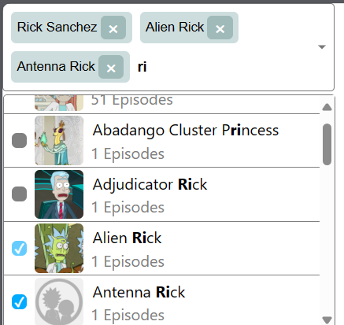

# Multi Select Component

This is a custom multi select component built using React and Typescript.

## Features

- **Dropdown Search**: Allows searching within the dropdown menu options.
- **API Integration**: Can be connected to an API for fetching data.
- **Loading State**: Supports a loading state while fetching data from an API.
- **Selectable Options**: Users can select options from the dropdown menu.
- **Dynamic Value Management**: Utilizes `value` and `setValue` props for managing selected data.
- **Search Text Management**: Uses `searchText` and `setSearchText` props for managing input text within the search field.

## Props

- **options**: Array of objects representing the options in the dropdown menu.
- **value**: Array of currently selected values.
- **setValue: Function to set the selected values.
- **searchText**: Text entered in the search input field.
- **setSearchText**: Function to set the search input text.
- **fetchData (Optional)**: Function to fetch data from an API.
- **loading (Optional)**: Boolean state indicating whether data is being loaded from an API.
